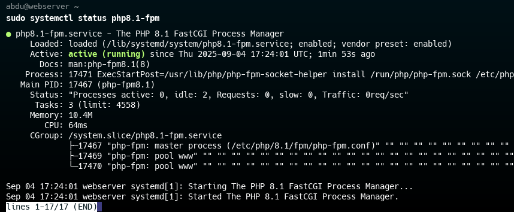
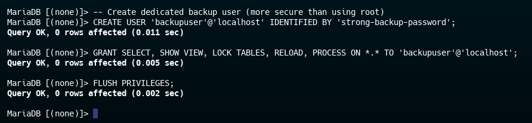

# WordPress LEMP Stack Deployment with Secure Database Access

## 📋 Table of Contents
1. [Project Overview](#-project-overview)
2. [Architecture Design](#-architecture-design)
3. [VM Setup & Configuration](#-vm-setup--configuration)
4. [Web Server Setup (VM1)](#-web-server-setup-vm1)
5. [Database Server Setup (VM2)](#-database-server-setup-vm2)
6. [Backup & Recovery System](#-backup--recovery-system)
7. [Secure Database Access Methods](#-secure-database-access-methods)
8. [Security Hardening](#-security-hardening)
9. [Testing & Validation](#-testing--validation)
10. [Troubleshooting](#-troubleshooting)

## 🎯 Project Overview

This project deploys a secure WordPress website using the LEMP stack (Linux, Nginx, MySQL/MariaDB, PHP) across two virtual machines with strict security measures and multiple database access methods for developers.

### Key Features:
- 🔒 Secure isolated network architecture
- 🛡️ Multiple database access methods without direct SSH
- 💾 Automated daily backups with retention policy
- 🔐 Security hardening with fail2ban and firewall rules
- 👨‍💻 Read-only developer access implementation

## 📊 Architecture Design
 
### Network Architecture:
- **VM1 (Web Server)**: Public IP: 192.168.122.214, Private IP: 192.168.100.2
- **VM2 (DB Server)**: Private IP: 192.168.100.3
- **Private Network**: 192.168.100.0/24

### Security Zones:
- **Public Zone**: Web server with HTTP/HTTPS access
- **Private Zone**: Database server with no direct internet access
- **Development Access**: Secure database connectivity without SSH

## 🖥️ VM Setup & Configuration

### Initial Setup (Both VMs)
```bash
# Update system and install security packages
sudo apt update && sudo apt upgrade -y
sudo apt install ufw fail2ban -y

# Configure firewall
sudo ufw allow ssh
sudo ufw allow http
sudo ufw allow https
sudo ufw enable

# Disable SSH password authentication
sudo sed -i 's/#PasswordAuthentication yes/PasswordAuthentication no/g' /etc/ssh/sshd_config
sudo systemctl restart sshd
```


## 🌐 Web Server Setup (VM1)

### DNS Configuration
Add to `/etc/hosts`:
```
192.168.122.214 myWordpress.com
```


### Install LEMP Components
```bash
sudo apt install nginx php-fpm php-mysql php-curl php-gd php-mbstring \
php-xml php-xmlrpc php-soap php-intl php-zip -y
```



### Deploy WordPress
```bash
cd /tmp && wget https://wordpress.org/latest.tar.gz
tar -xzvf latest.tar.gz
sudo mv wordpress /var/www/html/
sudo chown -R www-data:www-data /var/www/html/wordpress
sudo chmod -R 755 /var/www/html/wordpress
```


### Configure Nginx
Create `/etc/nginx/sites-available/wordpress`:
```nginx
server {
    listen 80;
    server_name myWordpress.com;
    root /var/www/html/wordpress;
    index index.php index.html index.htm;

    location / {
        try_files $uri $uri/ /index.php?$args;
    }

    location ~ \.php$ {
        include snippets/fastcgi-php.conf;
        fastcgi_pass unix:/var/run/php/php8.1-fpm.sock;
        fastcgi_param SCRIPT_FILENAME $document_root$fastcgi_script_name;
        include fastcgi_params;
    }

    location ~ /\.ht {
        deny all;
    }
}
```

Enable the site:
```bash
sudo ln -s /etc/nginx/sites-available/wordpress /etc/nginx/sites-enabled/
sudo nginx -t
sudo systemctl reload nginx
```


## 🗄️ Database Server Setup (VM2)

### Install MariaDB
```bash
sudo apt install mariadb-server -y
sudo mysql_secure_installation
```

### Configure Network Binding
Edit `/etc/mysql/mariadb.conf.d/50-server.cnf`:
```ini
bind-address = 192.168.100.3
```


### Create Databases and Users
```sql
-- WordPress database
CREATE DATABASE wordpress;
CREATE USER 'wpuser'@'192.168.100.2' IDENTIFIED BY 'strong-password';
GRANT ALL PRIVILEGES ON wordpress.* TO 'wpuser'@'192.168.100.2';

-- Additional databases
CREATE DATABASE fortstak;
CREATE DATABASE svkey;
GRANT ALL PRIVILEGES ON fortstak.* TO 'wpuser'@'192.168.100.2';
GRANT ALL PRIVILEGES ON svkey.* TO 'wpuser'@'192.168.100.2';

FLUSH PRIVILEGES;
```


### Firewall Rules for Database
```bash
sudo ufw allow from 192.168.100.2 to any port 3306
```


## 💾 Backup & Recovery System

### Backup Script
Create `/usr/local/bin/db_backup.sh`:
```bash
#!/bin/bash
BACKUP_DIR="/backups/databases"
MYSQL_USER="backupuser"
MYSQL_PASSWORD="backup-password"
RETENTION_DAYS=7
DATE=$(date +%Y%m%d_%H%M%S)

DATABASES=$(mysql -u$MYSQL_USER -p$MYSQL_PASSWORD -e "SHOW DATABASES;" | grep -Ev "(Database|information_schema|performance_schema|mysql)")

for DB in $DATABASES; do
    DB_DIR="$BACKUP_DIR/$DB"
    mkdir -p "$DB_DIR"
    BACKUP_FILE="$DB_DIR/${DB}_backup_$DATE.sql.gz"
    mysqldump -u$MYSQL_USER -p$MYSQL_PASSWORD --single-transaction "$DB" | gzip > "$BACKUP_FILE"
    find "$DB_DIR" -name "*.sql.gz" -type f -mtime +$RETENTION_DAYS -delete
done
```

<!--  -->

### Create Backup User
```sql
CREATE USER 'backupuser'@'localhost' IDENTIFIED BY 'backup-password';
GRANT SELECT, LOCK TABLES ON *.* TO 'backupuser'@'localhost';
FLUSH PRIVILEGES;
```


### Backup Validation
```bash
# Verify backups exist
ls -la /backups/databases/*/

# Test restoration
/usr/local/bin/db_restore.sh
```


### Schedule Backups
```bash
sudo crontab -e
# Add: 0 3 * * * /usr/local/bin/db_backup.sh >/dev/null 2>&1
```


### Restoration Script
Create `/usr/local/bin/db_restore.sh` for easy recovery:


#### Restoration Test


## 🔐 Secure Database Access Methods

### Method 1: SSH Tunnel
```bash
ssh -L 33306:192.168.100.3:3306 user@192.168.122.214 -N
mysql -h 127.0.0.1 -P 33306 -u dev_readonly -p
```


### Method 2: Nginx TCP Proxy
Create `/etc/nginx/stream.conf.d/mysql-proxy.conf`:
```nginx
stream {
    upstream mysql_backend {
        server 192.168.100.3:3306;
    }
    server {
        listen 3306;
        proxy_pass mysql_backend;
    }
}
```

Include in `/etc/nginx/nginx.conf`:
```nginx
include /etc/nginx/stream.conf.d/*.conf;
```


### Method 3: MySQL Router

MySQL Router provides a lightweight middleware for routing database connections securely from the web server to the database server, without exposing the DB port directly.

#### 🛠️ MySQL Router Setup (Port 4044)

**Step 1: Install MySQL Router**
```bash
sudo apt update
sudo apt install mysql-router -y
```

**Step 2: Configure MySQL Router**
Create the configuration directory (if it doesn't exist):
```bash
sudo mkdir -p /etc/mysqlrouter/conf.d
```
Create or edit the main configuration file:
```bash
sudo nano /etc/mysqlrouter/mysqlrouter.conf
```
Add the following configuration:
```ini
[DEFAULT]
logging_folder = /var/log/mysqlrouter
runtime_folder = /var/run/mysqlrouter
config_folder = /etc/mysqlrouter
data_folder = /var/lib/mysqlrouter

[logger]
level = INFO

[routing:read_write]
bind_address = 0.0.0.0
bind_port = 4044
destinations = 192.168.100.3:3306
routing_strategy = first-available
protocol = classic
```

**Step 3: Create a Systemd Service (if not auto-created)**
```bash
sudo nano /etc/systemd/system/mysqlrouter.service
```
Paste:
```ini
[Unit]
Description=MySQL Router
After=network.target

[Service]
Type=simple
User=mysqlrouter
Group=mysqlrouter
ExecStart=/usr/bin/mysqlrouter -c /etc/mysqlrouter/mysqlrouter.conf
Restart=on-failure
RestartSec=5

[Install]
WantedBy=multi-user.target
```

**Step 4: Set Proper Permissions**
```bash
# Create mysqlrouter user if needed
sudo id mysqlrouter || sudo useradd -r -s /bin/false mysqlrouter

# Set ownership for config, log, and data directories
sudo mkdir -p /var/log/mysqlrouter /var/lib/mysqlrouter /var/run/mysqlrouter
sudo chown -R mysqlrouter:mysqlrouter /etc/mysqlrouter /var/log/mysqlrouter /var/lib/mysqlrouter /var/run/mysqlrouter
```

**Step 5: Start and Enable MySQL Router**
```bash
sudo systemctl daemon-reload
sudo systemctl enable mysqlrouter
sudo systemctl start mysqlrouter
sudo systemctl status mysqlrouter
```

**Step 6: Test the Connection**
From a client or the web server:
```bash
mysql -h myWordpress.com -P 4044 -u dev_readonly -p
```

> **Tip:** Ensure firewall rules allow inbound traffic on port 4044.


### Firewall Rules for Access
```bash
sudo ufw allow 3306/tcp
sudo ufw allow 4044/tcp
```


## 🛡️ Security Hardening

### Fail2Ban Configuration
```bash
sudo apt install fail2ban -y
sudo systemctl enable fail2ban
sudo systemctl start fail2ban
```


### Read-Only Developer User
```sql
CREATE USER 'dev_readonly'@'%' IDENTIFIED BY 'readonly-password';
GRANT SELECT ON wordpress.* TO 'dev_readonly'@'%';
GRANT SELECT ON fortstak.* TO 'dev_readonly'@'%';
GRANT SELECT ON svkey.* TO 'dev_readonly'@'%';
FLUSH PRIVILEGES;
```


## ✅ Testing & Validation

### Database Connection Tests
```bash
# Test SSH tunnel
mysql -h 127.0.0.1 -P 33306 -u dev_readonly -p -e "SHOW DATABASES;"

# Test Nginx proxy
mysql -h myWordpress.com -P 3306 -u dev_readonly -p -e "SHOW DATABASES;"

# Test MySQL router
mysql -h myWordpress.com -P 4044 -u dev_readonly -p -e "SHOW DATABASES;"
```


## Methods Comparison Table:
## 🔐 Database Access Methods Comparison

| Feature | SSH Tunnel | Nginx TCP Proxy | MySQL Router |
|---------|------------|-----------------|-------------|
| **Security Level** | 🔐🔐🔐🔐🔐 (Excellent) | 🔐🔐🔐🔐 (Very Good) | 🔐🔐🔐🔐 (Very Good) |
| **Encryption** | End-to-end SSH encryption | TCP proxy (relies on MySQL SSL) | Protocol-aware with encryption |
| **Setup Complexity** | Easy (client-side) | Medium (server config) | Medium (install + config) |
| **Performance** | Good (SSH overhead) | Excellent (low overhead) | Very Good (optimized) |
| **Port Used** | 33306 (local) → 3306 (remote) | 3306 (standard MySQL) | 4044 (custom) |
| **Availability** | Manual connection required | Always available | Always available |
| **Authentication** | SSH keys + DB credentials | DB credentials only | DB credentials only |
| **Best For** | Secure temporary access | Permanent production access | Enterprise environments |
| **Firewall Rules** | Only SSH (port 22) | MySQL port (3306) | Custom port (4044) |
| **Load Balancing** | No | Basic TCP-level | Advanced MySQL-aware |
| **Maintenance** | Manual management | Low (uses existing Nginx) | Medium (additional service) |
| **Connection String** | `-h 127.0.0.1 -P 33306` | `-h webserver -P 3306` | `-h webserver -P 4044` |

### Read-Only Access Validation
```sql
-- This should work
SELECT * FROM wp_posts;

-- This should fail
INSERT INTO wp_posts (post_title) VALUES ('Test Post');
```


## 🚨 Troubleshooting

### Common Issues and Solutions

1. **DNS Resolution Issues**
   ```bash
   # Add to /etc/resolv.conf
   nameserver 8.8.8.8
   nameserver 8.8.4.4
   ```

2. **Connection Timeouts**
   ```bash
   # Check firewall rules
   sudo ufw status
   
   # Verify service status
   sudo systemctl status mysql
   sudo systemctl status nginx
   ```

3. **Permission Denied Errors**
   ```bash
   # Reset WordPress permissions
   sudo chown -R www-data:www-data /var/www/html/wordpress
   sudo find /var/www/html/wordpress -type d -exec chmod 755 {} \;
   sudo find /var/www/html/wordpress -type f -exec chmod 644 {} \;
   ```

4. **Database Connection Issues**
   ```bash
   # Check MySQL binding
   sudo netstat -tlnp | grep mysql
   
   # Verify user privileges
   mysql -u root -p -e "SHOW GRANTS FOR 'wpuser'@'192.168.100.2';"
   ```

## 🎯 Conclusion

### Successfully Implemented Features:
- ✅ Secure LEMP stack deployment
- ✅ Isolated database server architecture
- ✅ Three secure database access methods
- ✅ Automated backup system with retention policy
- ✅ Comprehensive security hardening
- ✅ Read-only developer access
- ✅ Full testing and validation

### Security Achievements:
- 🔒 No password SSH authentication
- 🛡️ Fail2Ban intrusion prevention
- 🔐 Database network isolation
- 👨‍💻 Secure developer access without SSH
- 💾 Encrypted automated backups

This implementation provides a production-ready WordPress environment with enterprise-grade security and multiple access options for development teams.